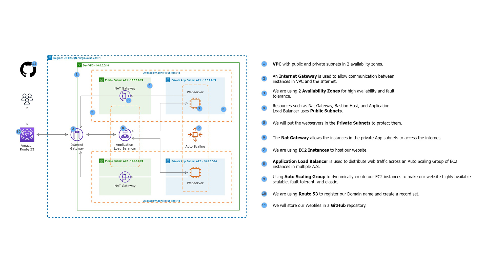

---

# Hosting an HTML Website on an EC2 Instance

## Overview

This project demonstrates how to host an HTML website on an AWS EC2 instance by utilizing a GitHub repository and automating the deployment process with a bash script. The script is designed to set up the necessary environment on the EC2 instance, download the website files from the GitHub repository, and configure the Apache web server to serve the website.

## Task: Hosting from a GitHub Repository

### Description

The website files are stored in a GitHub repository. A bash script is used to clone the repository, extract the website files, and configure the website on an EC2 instance running an Apache web server.

### Script

```bash
#!/bin/bash
sudo su
yum update -y
yum install -y httpd git
git clone https://github.com/simbaaws88/Hosting-an-HTML-Website-on-an-EC2-Instance.git
cd Hosting-an-HTML-Website-on-an-EC2-Instance
unzip techmax.zip
mv techmax/* /var/www/html
systemctl enable httpd
systemctl start httpd
```

### Steps

1. **Update Packages**: The script begins by updating all packages on the EC2 instance to ensure they are up-to-date.
2. **Install Apache and Git**: The script installs the Apache web server (`httpd`) and Git, which is necessary for cloning repositories.
3. **Clone the GitHub Repository**: The script clones the specified GitHub repository containing the website files.
4. **Extract and Deploy**: The script extracts the `techmax.zip` file and moves the extracted files to the appropriate directory for the Apache server to serve.
5. **Start Apache Server**: The script enables the Apache service to start on boot and starts the service.

### Result

The website is successfully hosted on the EC2 instance using files from the GitHub repository. The Apache server is configured to serve the website, making it accessible to users.

## Conclusion

This task successfully demonstrates how to automate the deployment of a website on an AWS EC2 instance using a bash script and a GitHub repository. The script efficiently handles the entire process, from setting up the environment to configuring the web server and hosting the website.
